# CSML25 – Bài 1: Học máy với dữ liệu dạng bảng (Tabular Data)
# Dự đoán tình trạng sức khỏe của cún dựa trên giống và các đặc trưng sức khỏe liên quan

## Thông tin chung

| Mục | Chi tiết |
| :--- | :--- |
| **Tên Môn học** | Học máy - CO3117 |
| **Học kỳ/Năm học** | 251 / 2025 |
| **Giảng viên** | TS. Lê Thành Sách |
| **Tên nhóm** | CSML25 |
| **Thành viên** | Nguyễn Đăng Khánh (2311512), Bùi Ngọc Phúc (2312665), Đinh Hoàng Chung (2310359) |

## 1. Bài toán & dữ liệu

### 1.1 Mục tiêu
- Xây dựng pipeline machine learning **truyền thống** cho bài toán phân lớp tình trạng sức khỏe của cún dựa trên dữ liệu dạng bảng .
- Thực hiện **EDA**:
  - Thống kê mô tả cho các đặc trưng kiểu số (numeric), kiểu phân loại (categorical) và biến mục tiêu (target)
  - Kiểm tra missing value, trực quan hóa dữ liệu, phân tích xu hướng phân phối, phát hiện outlier.
- Tiền dữ liệu:
  - Xử lý missing value bằng kỹ thuật imputation
  - Chuẩn hóa categorical value bằng kỹ thuật encoding.
  - Xử lý outliers bằng phương pháp clipping.
  - Chuẩn hóa các biến numeric bằng các phương pháp scaling.
  - Trích xuất và lựa chọn đặc trưng và thử nghiệm với phương pháp giảm số chiều (như PCA,...).
- Thử nghiệm huấn luyện các mô hình:
  - Logistic Regression.
  - SVM - Support vector machine.
  - Random Forest.
  - Thử nghiệm pipeline học sâu với mô hình MLP.
- So sánh và đánh giá các kết quả thử nghiệm.
---

### 1.2 Tổng quan Bộ dữ liệu
* **Tên:** Canine Wellness Classification Dataset (Synthetic, 10,000 Samples).
* **Mục tiêu phân loại:** Dự đoán liệu một con cún có khỏe mạnh (`Yes`) hay không (`No`) (Phân loại nhị phân).
* **Kích thước:** 10,000 mẫu quan sát và 21 cột (features).
* **Phân loại Features:** Có 8 cột kiểu số (Numeric) và 12 cột kiểu phân loại (Categorical).

### 1.3 Số lượng unique value:
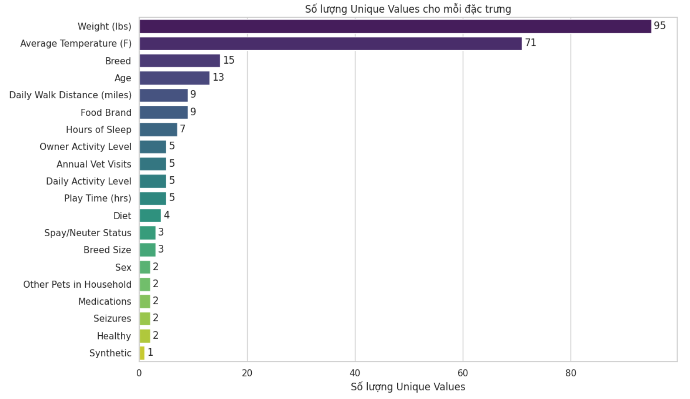

### 1.4 Thống kê mô tả cho các đặc trưng kiểu số (numeric features):
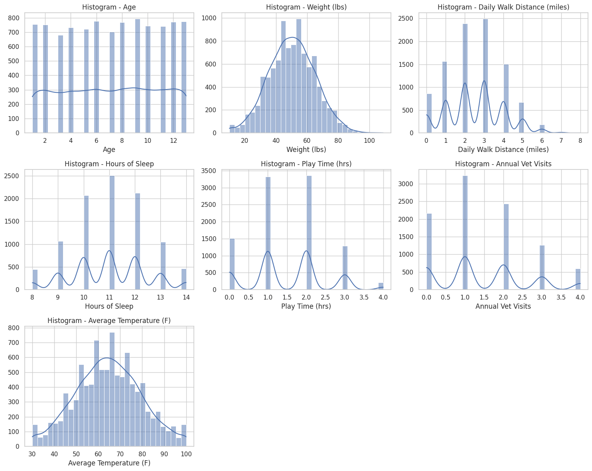

### 1.5 Thống kê mô tả cho các đặc trưng kiểu phân loại (categorical features):
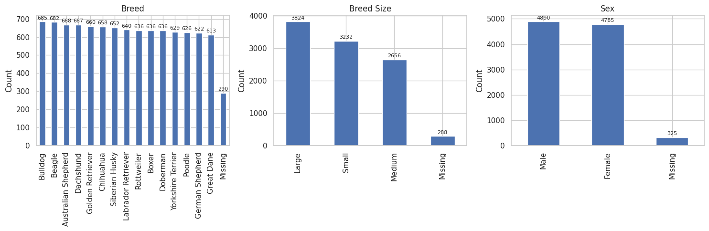
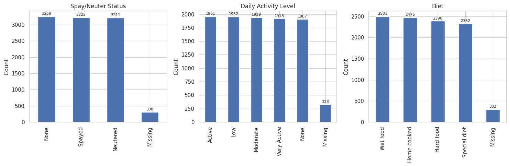
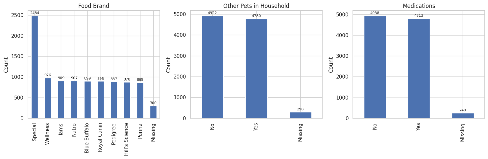
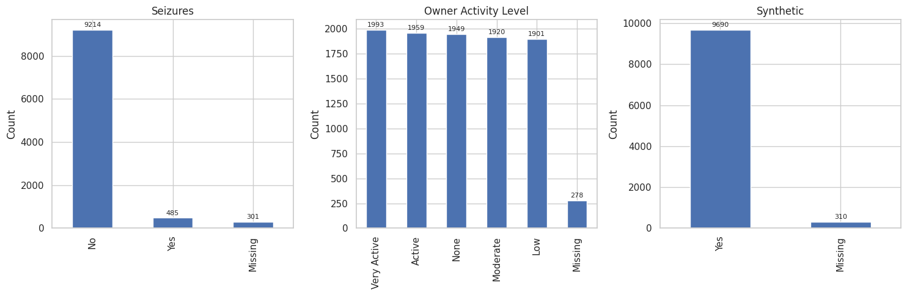

### 1.6 Phân bố Biến mục tiêu (`Healthy`)
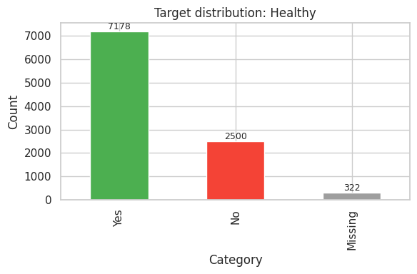

* Biến mục tiêu có sự mất cân bằng lớp nhẹ: **Yes (Khỏe mạnh):** 71.78% và **No (Không khỏe mạnh):** 25.0%. (3.22% mẫu thiếu đã bị loại bỏ).

### 1.7 Giá trị thiếu (Missing Values)
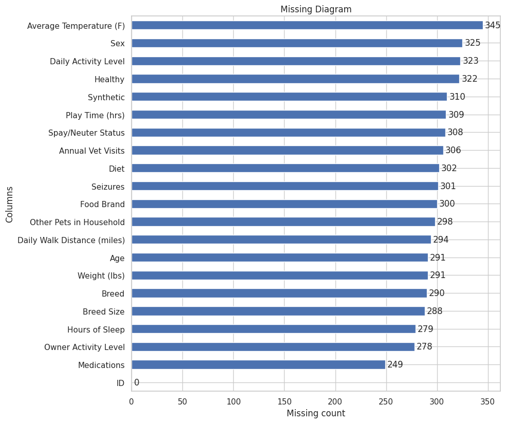

* Tỉ lệ Missing: Dao động từ **2.49%** đến **3.45%** trên hầu hết các cột.

### 1.8 Ma trận tương quan

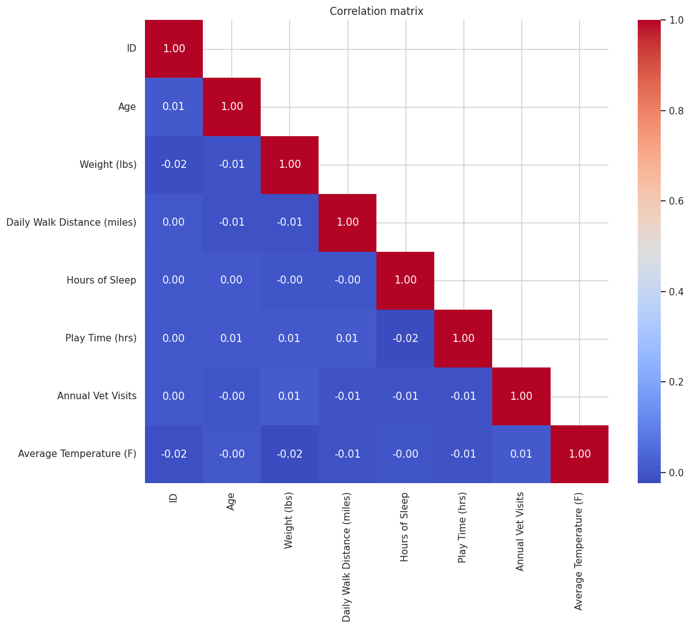

* Hầu hết các hệ số tương quan đều gần bằng 0, nghĩa là gần như không có mối liên hệ tuyến tính đáng kể giữa các biến. Điều này cho thấy các biến trong bộ dữ liệu khá độc lập với nhau.

### 1.9 Phát hiện outliers

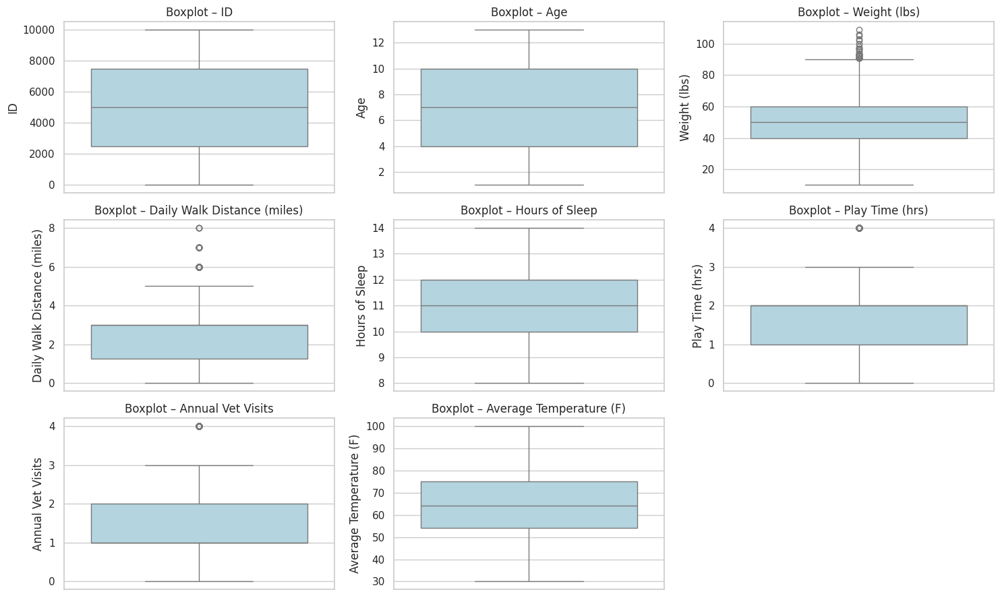
Ở biến Weight (lbs), khoảng tứ phân vị (IQR) nằm xung quanh 40–60 lbs. Tuy nhiên, nhiều giá trị vượt quá ngưỡng Q3 + 1.5×IQR (trên 90 lbs) xuất hiện, tạo thành các ngoại lệ phía trên (upper outliers).

---

## 2. Tiền xử lý dữ liệu
1.  **Xử lí giá trị thiếu ở biến mục tiêu**
   - Loại bỏ các hàng chứa giá trị bị thiếu trong cột này.
   - Kết quả cho thấy có khoảng 3.22% mẫu dữ liệu bị thiếu nhãn, do đó số lượng mẫu đã giảm từ 10,000 xuống còn 9,678.
1.  **Chia Train/Test:** Dữ liệu được chia theo tỷ lệ **80/20** (`test_size=0.2`) với tham số `stratify=y`.
2.  **Xử lý Missing Values:**
    * Các cột **Numeric** được impute bằng **Median**.
    * Các cột **Categorical** được impute bằng **Most Frequent** (Mode).
3.  **Xử lý Outliers:** Sử dụng kỹ thuật **Clipping** cho các biến Numeric.
4.  **Scaling (Chuẩn hóa):** Sử dụng **StandardScaler** cho các biến Numeric.
5.  **Encoding:** Sử dụng **OneHotEncoder** cho các biến Categorical.
6.  **Xem xét Kỹ thuật Giảm chiều dữ liệu (Dimensionality Reduction - PCA)**
    * **Kỹ thuật được xem xét:** Phân tích Thành phần Chính (PCA).
    * **Mục đích:** Giảm số lượng đặc trưng đầu vào, đơn giản hóa mô hình và giảm thời gian huấn luyện.
    * **Phân tích:** Dựa trên kết quả Ma trận Tương quan (Correlation Matrix) trong EDA, các đặc trưng Numeric được xác định có **tương quan rất thấp** với nhau (hệ số tương quan gần 0).
    * **Quyết định:** PCA **không được áp dụng** vào pipeline tiền xử lý. Việc giảm chiều dữ liệu trong trường hợp các đặc trưng đã độc lập sẽ dẫn đến việc **mất mát thông tin quan trọng** và có khả năng **làm giảm độ chính xác (Accuracy)** của mô hình.

---

## 3. Kết quả thực nghiệm (Experimental Results):

Nhóm đã thử nghiệm:
- Pipeline truyền thống được triển khai: Logistic Regression, SVM (RBF), và Random Forest
    - Đánh giá trên tập test.
    - Cross-Validation (5-fold CV)
- Pipeline học sâu với mô hình Mạng nơ-ron đa lớp (MLP – Multi-Layer Perceptron)
### Pipeline học máy truyền thống:
### 3.1. Kết quả trên TEST SET (Tập kiểm tra)

| Model | Accuracy | F1 | ROC-AUC | PR-AUC |
| :--- | :--- | :--- | :--- | :--- |
| **Random Forest** | 0.932 | **0.956** | 0.978 | **0.992** |
| **SVM (RBF)** | 0.924 | 0.950 | 0.969 | 0.989 |
| **Logistic Regression** | 0.880 | 0.920 | 0.936 | 0.975 |

**ROC Curves & Precision-Recall Curves**

  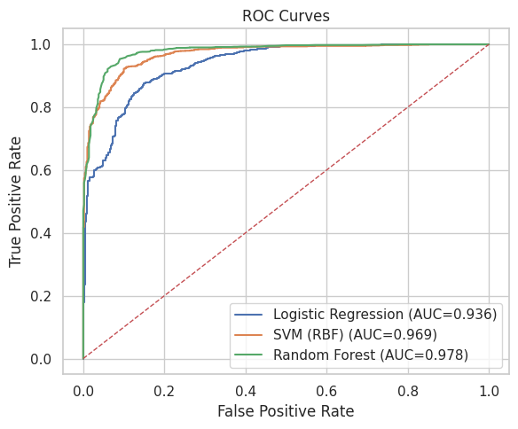
  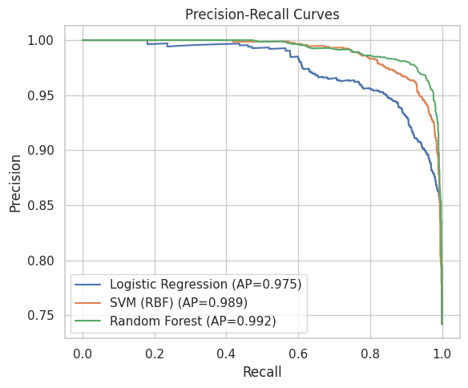

**Confusion matrices**

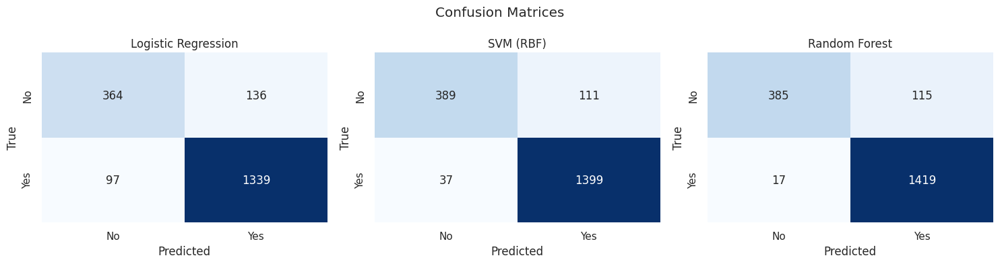

### 3.2. Kết quả Cross-Validation (5-fold CV)

| Model | Accuracy | F1 | ROC-AUC | PR-AUC |
| :--- | :--- | :--- | :--- | :--- |
| **Random Forest** | 0.933 | **0.956** | 0.979 | **0.992** |
| **SVM (RBF)** | 0.925 | 0.951 | 0.970 | 0.989 |
| **Logistic Regression** | 0.885 | 0.923 | 0.937 | 0.976 |

---

### Pipeline học sâu với mô hình Mạng nơ-ron đa lớp (MLP – Multi-Layer Perceptron):
### 3.3. Kiến trúc Mô hình (Model Architecture)

* **Đầu vào (Input Layer):** Số lượng nơ-ron bằng với số lượng đặc trưng sau khi tiền xử lý (53 cột).
* **Các Lớp Ẩn (Hidden Layers):** Thử nghiệm với các cấu hình khác nhau (ví dụ: (32,), (64, 32), và (128, 64)).
* **Hàm Kích hoạt (Activation Function):** **ReLU** cho các lớp ẩn.
* **Lớp Đầu ra (Output Layer):** Một nơ-ron với hàm kích hoạt **Sigmoid** cho phân loại nhị phân.

### 3.44. Các Thuật toán và Kỹ thuật Chính

| Thuật toán/Kỹ thuật | Mục đích | Chi tiết |
| :--- | :--- | :--- |
| **Hàm Tổn thất (Loss Function)** | Đo lường sai số. | **Binary Cross-Entropy Loss**. |
| **Bộ Tối ưu hóa (Optimizer)** | Thuật toán điều chỉnh trọng số. | **Adam**. |
| **Tỷ lệ Học (Learning Rate)** | Xác định độ lớn của bước nhảy. | Thử nghiệm với **0.001** và **0.0005**. |
| **Kỹ thuật Dropout** | Chống lại **Overfitting**. | Loại bỏ ngẫu nhiên **20% (0.2)** hoặc **30% (0.3)** nơ-ron. |
| **Epochs** | Số lần toàn bộ tập huấn luyện được chạy qua mạng. | Áp dụng **Early Stopping** để ngăn ngừa overfitting. |

### 3.5. Kết quả của mô hình học sâu MLP:

| Hidden Layers | Dropout | Learning Rate | Batch Size | Accuracy | F1 | ROC-AUC | PR-AUC |
| :--- | :--- | :--- | :--- | :--- | :--- | :--- | :--- |
| (32,) | (0.2,) | 0.0010 | 128 | 0.925620 | 0.950853 | 0.964015 | 0.986353 |
| (64, 32) | (0.3, 0.2) | 0.0010 | 128 | 0.923554 | 0.949523 | 0.964320 | 0.986577 |
| (128, 64) | (0.3, 0.3) | 0.0005 | 256 | 0.912707 | 0.941664 | 0.958421 | 0.984180 |

### 3.6. Kết quả của 4 mô hình khi sử dụng PCA:
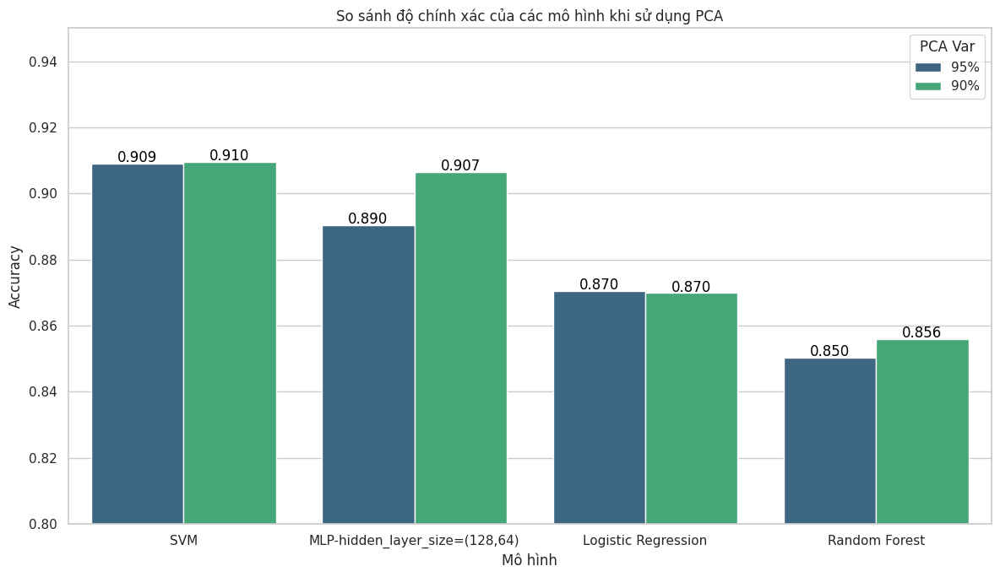

## 4. Kết luận và so sánh tất cả các mô hình đã thử nghiệm
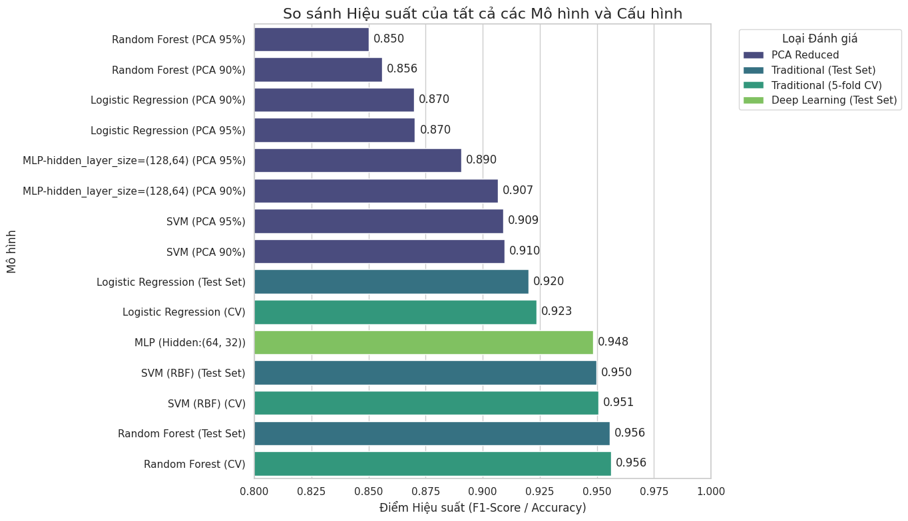

### Nhận xét chung
* **Random Forest** là mô hình có hiệu suất tốt nhất, đạt điểm **F1** và **PR-AUC** cao nhất (F1 ~ 0.956, PR-AUC ~ 0.992).
* **SVM (RBF)** và **MLP** cho kết quả tương đương, gần sát với Random Forest.

### Kết luận
Hiệu suất cao của các mô hình truyền thống (Random Forest, SVM) cho thấy **bộ đặc trưng (features) đã được trích xuất tốt** thông qua quy trình tiền xử lý, đặc biệt là OneHotEncoder. Việc tăng độ phức tạp với mô hình học sâu (MLP) không mang lại lợi ích đáng kể, chứng tỏ dữ liệu đã được khai thác gần như tối đa bởi các mô hình truyền thống.
