# CSML25 – Bài 2: Học máy với dữ liệu dạng văn bản (Text Data) (Notebook `CSML25_BTL2.ipynb`)
# Text Emotion Classification 

## 1. Bài toán & dữ liệu

### 1.1 Mục tiêu

- Xây dựng pipeline machine learning **truyền thống** cho bài toán phân loại cảm xúc câu tiếng Anh.
- Thực hiện **EDA**:
  - Phân bố nhãn, độ dài câu, kiểm tra missing value, duplicate.
- Thử nghiệm nhiều mô hình:
  - BoW + Naive Bayes  
  - TF-IDF + Logistic Regression  
  - TF-IDF + Linear SVM
  - Embedding + Logistic Regression (LR) + Linear SVM (LinearSVC):
    - all-MiniLM-L6-v2 
    - DistilBERT-STS 
- Xây dựng pipeline **deep learning**:
  - CNN + pretrained word embeddings (GloVe)  
  - Trích xuất embedding từ CNN, huấn luyện Random Forest trên embedding.

### 1.2 Dataset

- Nguồn: Kaggle – *Emotions dataset for NLP* (`praveengovi/emotions-dataset-for-nlp`).
- Task: phân loại câu vào 6 cảm xúc:
  `joy`, `sadness`, `anger`, `fear`, `love`, `surprise`.
- Kích thước ban đầu:
  - Train: 16 000 dòng  
  - Validation: 2 000 dòng  
  - Test: 2 000 dòng  

**Phân bố nhãn trên tập train**

  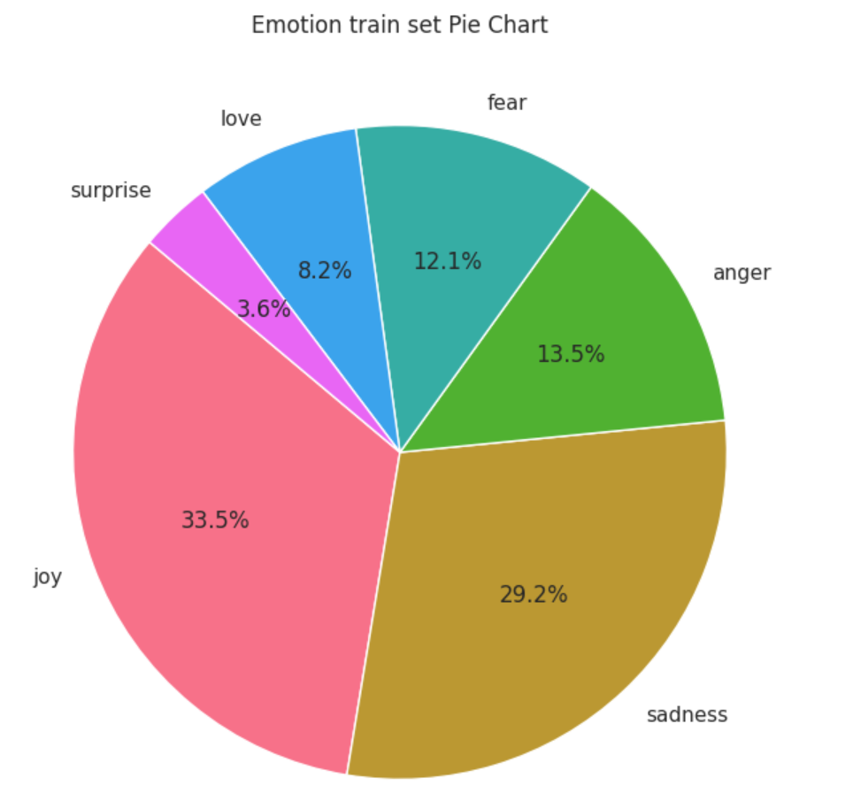
  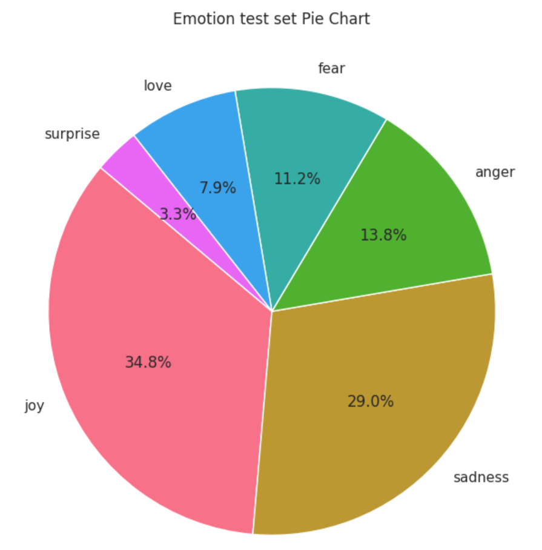
  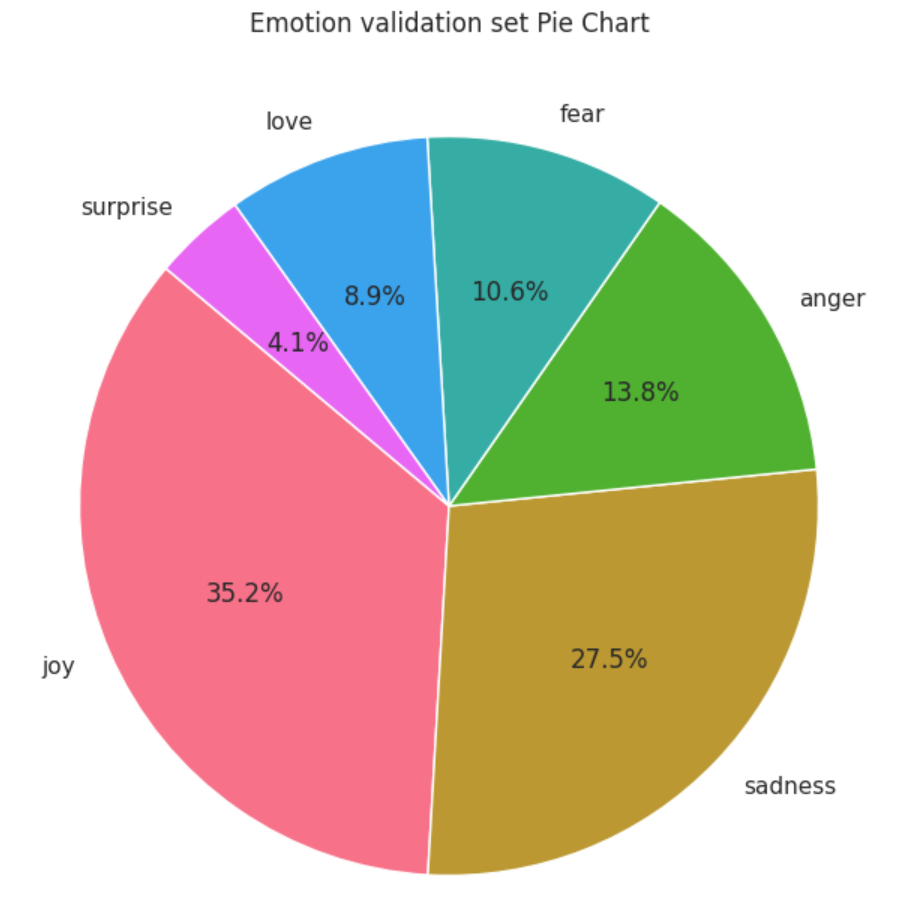

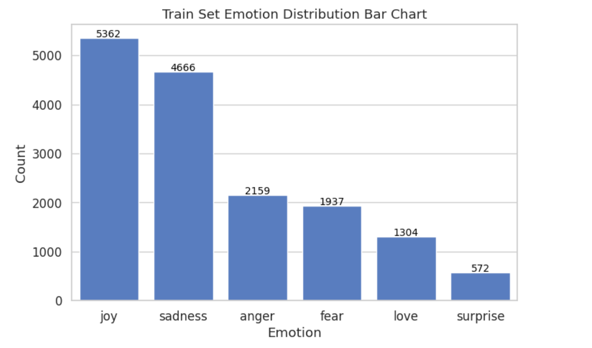 
Nhận xét:

- Dữ liệu **mất cân bằng**: `joy` và `sadness` chiếm phần lớn.
- `surprise` rất ít mẫu, dễ gây khó khăn cho mô hình ở lớp nhỏ.

---

## 2. Khám phá dữ liệu (EDA)

### 2.1 Độ dài câu (word count)

Notebook thêm cột `word_count` cho tập train và thống kê:

| Thống kê      | Giá trị |
|--------------|---------|
| Số mẫu       | 16 000  |
| Mean         | 19.17   |
| Std          | 10.99   |
| Min / Max    | 2 / 66  |
| Q1 / Q2 / Q3 | 11 / 17 / 25 |

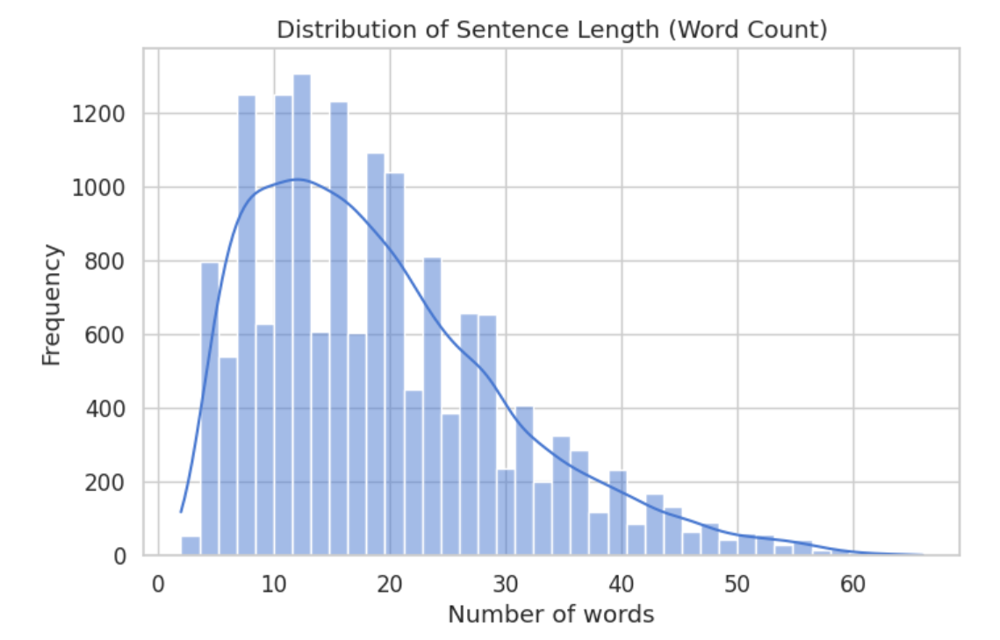
Độ dài trung bình theo từng cảm xúc:

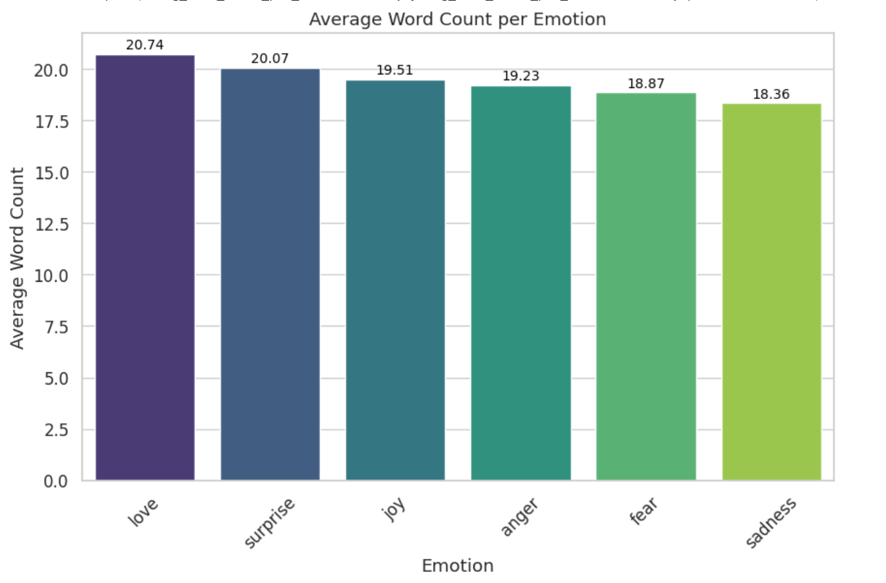

Nhận xét:

- Câu trong dataset nhìn chung **khá ngắn**, chủ yếu 10–25 từ.  
- Các cảm xúc tích cực/đặc biệt như `love`, `surprise` có xu hướng câu dài hơn một chút.  
- Điều này giúp các mô hình dựa trên Bag-of-Words / TF-IDF hoạt động tốt, vì câu không quá dài để gây sparsity quá lớn.

Trực quan hoá ngôn ngữ:

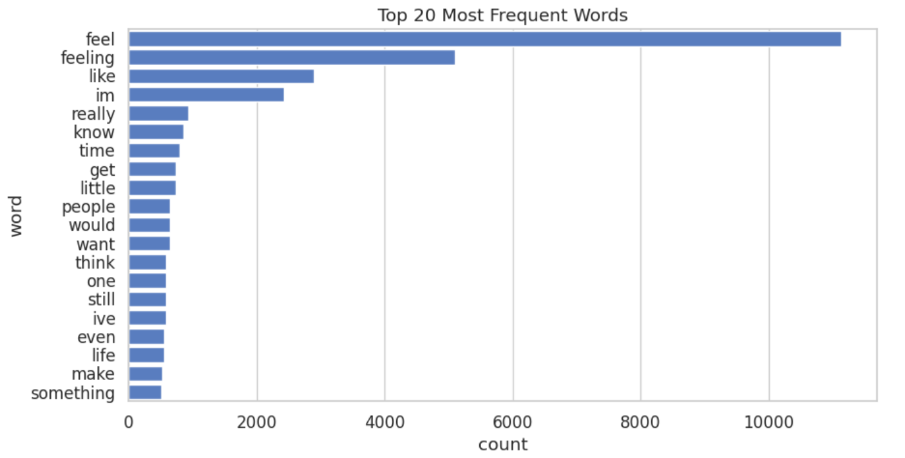

  
  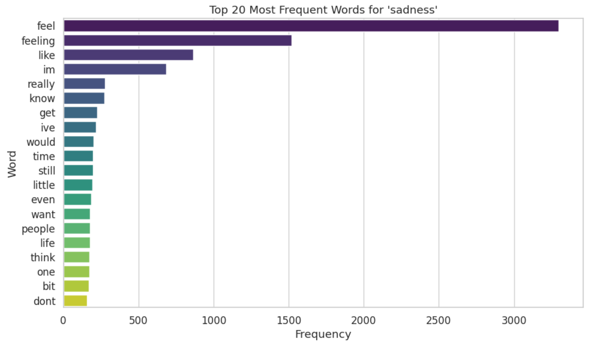
  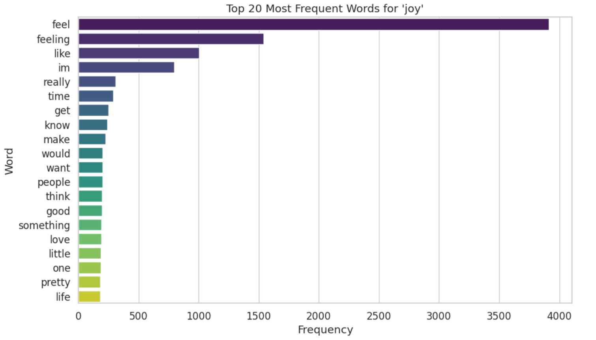

  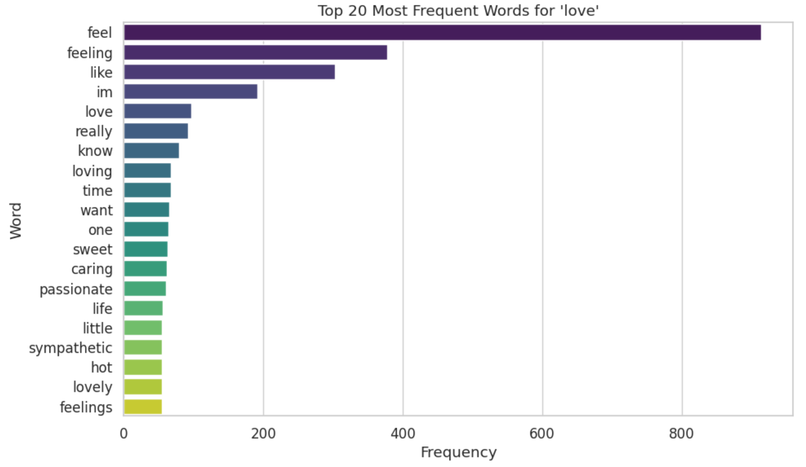
  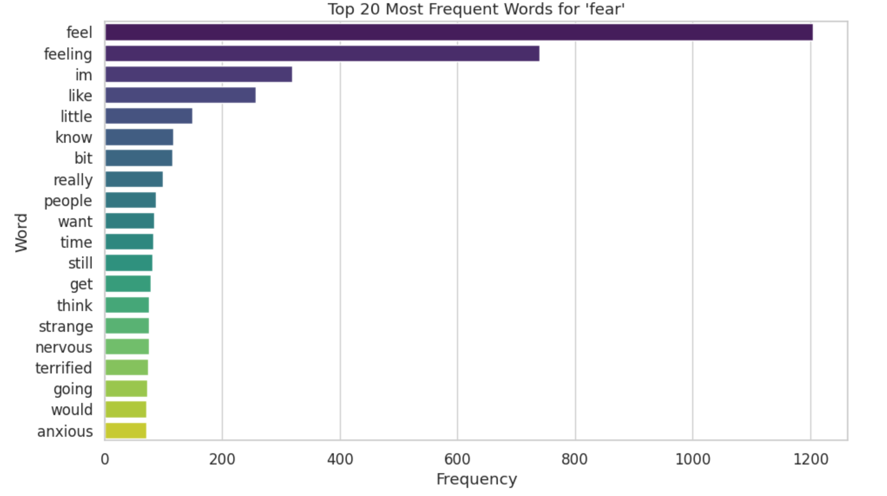
  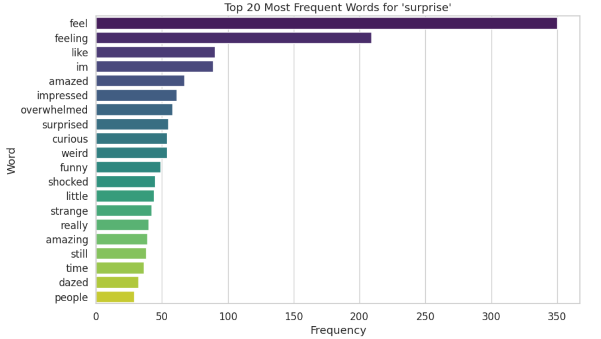

### 2.2 Missing values & duplicate

**Missing values** → Không có dòng bị thiếu dữ liệu.

**Duplicate and conflict** 
→ 1 dòng duplicate ở tập train 
→ 30 dòng xung đột do trùng nhau nhưng cùng label
- Sau khi:
  - Xóa duplicate trên cặp (`text`, `emotion`).  
  - Loại bỏ các text có conflict label (cùng câu nhưng label khác).  
- Kích thước train còn: **15 939 dòng**.

## 3. Kết quả thực nghiệm (Experimental Results)

### Tổng quan

Nhóm đã thử nghiệm **50+ cấu hình mô hình** khác nhau cho bài toán Text Emotion Classification, bao gồm:

- **Phương pháp đặc trưng**: TF-IDF, Bag of Words, BERT embeddings (MiniLM, DistilBERT)
- **N-gram**: Bigram, Trigram
- **Thuật toán**:  LinearSVC, Logistic Regression, Multinomial Naive Bayes
- **Kỹ thuật tối ưu**: Class balancing, GridSearchCV

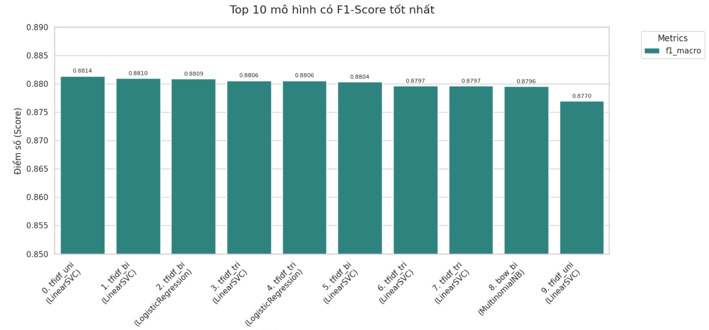

### Top 5 Mô hình tốt nhất

| Rank | Feature Set | Classifier | Accuracy | F1-Macro | Description |
|------|-------------|------------|----------|----------|-------------|
| 1 | TF-IDF Unigram | LinearSVC | 90.75% | **88.14%** | Balanced, No-CV |
| 2 | TF-IDF Bigram | LinearSVC | **91.10%** | 88.10% | Balanced, No-CV |
| 3 | TF-IDF Bigram | LogisticRegression | 90.75% | 88.09% | Balanced, GridSearchCV |
| 4 | TF-IDF Trigram | LinearSVC | 91.05% | 88.06% | Balanced, GridSearchCV |
| 5 | TF-IDF Trigram | LogisticRegression | 90.60% | 88.06% | Balanced, No-CV |

### So sánh các phương pháp

#### Phương pháp biểu diễn đặc trưng

| Method | Best Accuracy | Best F1-Macro |
|--------|---------------|---------------|
| **TF-IDF Unigram** | **90.75%** | **88.14%** |
| **BoW Bigram** | 90.85% | 87.96% |
| **BERT MiniLM** | 70.60% | 63.32% |
| **DistilBERT STS** | 69.20% | 61.76% |

**Nhận xét**: 
- TF-IDF Trigram cho kết quả tốt nhất
- BERT embeddings kém hơn ~20% (cần fine-tuning thay vì chỉ dùng embeddings)

#### Thuật toán phân loại

| Classifier | Best Accuracy | Best F1-Macro |
|------------|---------------|---------------|
| **LinearSVC** | **91.10%** | **88.06%** |
| **Logistic Regression** | **90.60%** | **88.06%** |
| **Multinomial NB** | 86.05% | 80.95% |

**Nhận xét**: LinearSVC và Logistic Regression có hiệu suất tương đương, vượt trội Naive Bayes ~5%

#### Impact của các kỹ thuật

| Technique | Impact | Note |
|-----------|--------|------|
| **Trigram vs Bigram** | +0.20% | Cải thiện nhẹ |
| **Class Balancing** | ±0-2% | Cải thiện F1-macro tốt hơn accuracy |
| **GridSearchCV** | -0.20% ~ 0% | Không cải thiện đáng kể |
| **Preprocessing** | +1.4% | **quan trọng** |

### Kết luận

#### ✅ Mô hình đề xuất

**TF-IDF Unigram + LinearSVC (Balanced)**
- Accuracy: **90.75%** | F1-Macro: **88.14%**
- Đơn giản, nhanh, không cần GPU
- Phù hợp cho production

**Mô hình thay thế**:  BoW Bigram + Logistic Regression (90.85%) - Dễ interpret

## So sánh mô hình tuyến tính với CNN + Random Forest

Trong notebook, CNN được dùng để trích xuất embedding, sau đó dùng Random Forest để phân loại. Kết quả classification report (trên test set 2000 mẫu):

| Metric        | Giá trị |
|---------------|---------|
| Accuracy      | 0.89    |
| Macro-F1      | 0.84    |
| Weighted-F1   | 0.89    |

Chi tiết theo từng lớp:

- Các lớp 0, 2, 4: precision/recall ~0.90–0.93, F1 ≈ 0.89–0.93.
- Lớp 3 và 5: F1 chỉ khoảng 0.70–0.74 do ít dữ liệu và phân bố không đều.

**Kết luận:** Với Accuracy 89%, phương pháp này tiệm cận sát với kết quả tốt nhất của LinearSVC (91.1%), chứng minh tiềm năng của việc sử dụng Deep Learning để tạo ra các biểu diễn đặc trưng dày đặc (dense representations) cho bài toán này.

---

Toàn bộ mã và chi tiết cài đặt xem trong notebook: **`CSML25_BTL2.ipynb`**.
